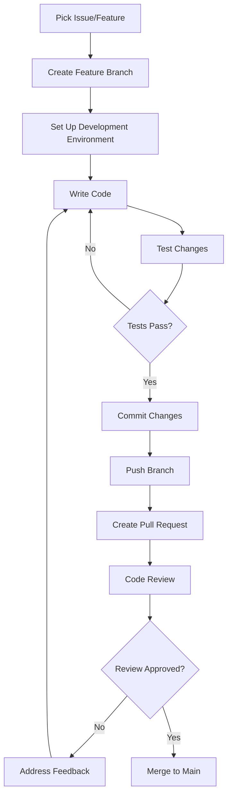

# Development Workflows

This guide covers common development patterns, workflows, and best practices for contributing to the Budget Planner project.

## 🔄 Development Lifecycle

### Standard Development Flow



## 🌟 Common Development Tasks

### 1. Adding a New GUI Window

#### Step-by-Step Process

**1. Choose Base Class**
```python
# Main application window
class MyWindow(BaseWindow):
    def __init__(self):
        super().__init__(plugin_scope="mywindow", title="My Window")

# Modal dialog
class MyDialog(BaseToplevelWindow): 
    def __init__(self, parent):
        super().__init__(parent, plugin_scope="mydialog", title="My Dialog")
```

**2. Implement Required Methods**
```python
def init_ui(self) -> None:
    """Initialize user interface - REQUIRED"""
    # Create UI components
    tk.Label(self.main_frame, text="My Window Content").pack(pady=10)
    
    # Add buttons, forms, etc.
    button_frame = tk.Frame(self.main_frame)
    button_frame.pack(pady=10)
    
    tk.Button(button_frame, text="Save", command=self.save_data).pack(side=tk.LEFT, padx=5)
    tk.Button(button_frame, text="Cancel", command=self.destroy).pack(side=tk.LEFT, padx=5)

def save_data(self):
    """Custom method for data handling"""
    # Validate input
    if self.validate_input():
        # Save to database
        success = self.perform_database_operation()
        if success:
            self.show_message("Data saved successfully!")
            self.destroy()
        else:
            self.show_message("Error saving data!")

def validate_input(self) -> bool:
    """Validate user input"""
    # Add validation logic
    return True
```

**3. Add Navigation**
```python
# In a plugin file like plugin_homepage_menu_myfeature.py
def add_to_menu(window, menu_bar):
    my_menu = tk.Menu(menu_bar, tearoff=0)
    my_menu.add_command(label="Open My Window", 
                        command=lambda: open_my_window(window))
    menu_bar.add_cascade(label="My Feature", menu=my_menu)

def open_my_window(parent_window):
    """Open the new window"""
    from gui.mywindow.mywindow import MyWindow  # Import here to avoid circular imports
    
    # For main windows
    new_window = MyWindow()
    new_window.run()
    
    # For modal dialogs  
    dialog = MyDialog(parent_window)
    parent_window.wait_window(dialog)  # Wait for dialog to close
```

### 2. Adding Database Functionality

#### Creating New Tables

**1. Add to Database Schema**
```python
# In src/utils/data/createdatabase_utils.py
def create_my_table(cursor, conn) -> None:
    """Create my custom table"""
    logger.debug("Creating my custom table...")
    try:
        cursor.execute('''
            CREATE TABLE IF NOT EXISTS tbl_MyTable (
                i8_MyID INTEGER PRIMARY KEY AUTOINCREMENT,
                str_Name TEXT UNIQUE NOT NULL,
                real_Value REAL DEFAULT 0.0,
                i8_ForeignKeyID INTEGER,
                str_CreatedDate TEXT NOT NULL,
                FOREIGN KEY (i8_ForeignKeyID) 
                    REFERENCES tbl_Account(i8_AccountID) 
                    ON DELETE CASCADE
            );
        ''')
        conn.commit()
        logger.debug("My custom table created successfully.")
    except sqlite3.Error as e:
        logger.error(f"Error creating my custom table: {e}")

# Add to create_database() function
@log_fn  
def create_database(db_path: Path = config.Database.PATH) -> None:
    # ... existing code ...
    create_my_table(cursor, conn)  # Add your table creation
```

**2. Create Utility Module**
```python
# src/utils/data/database/my_table_utils.py
import logging
from typing import List, Tuple, Optional
from utils.data.database_connection import DatabaseConnection
from utils.logging.logging_tools import log_fn
import config

logger = logging.getLogger(__name__)

@log_fn
def get_my_data(selected_columns: List[bool] = None) -> List[Tuple]:
    """Get data from my table with column selection"""
    conn = DatabaseConnection.get_connection()
    cursor = conn.cursor()
    
    columns = ["i8_MyID", "str_Name", "real_Value", "str_CreatedDate"] 
    if selected_columns:
        selected = [col for i, col in enumerate(columns) if selected_columns[i]]
        query = f"SELECT {', '.join(selected)} FROM tbl_MyTable"
    else:
        query = "SELECT * FROM tbl_MyTable"
    
    cursor.execute(query)
    return cursor.fetchall()

@log_fn
def add_my_record(name: str, value: float) -> bool:
    """Add new record with validation"""
    if not name.strip():
        logger.error("Name cannot be empty")
        return False
        
    conn = DatabaseConnection.get_connection()
    cursor = conn.cursor()
    
    try:
        cursor.execute('''
            INSERT INTO tbl_MyTable (str_Name, real_Value, str_CreatedDate) 
            VALUES (?, ?, date('now'))
        ''', (name, value))
        conn.commit()
        logger.info(f"Added record: {name}")
        return True
    except Exception as e:
        logger.error(f"Error adding record: {e}")
        return False

@log_fn 
def update_my_record(record_id: int, name: str, value: float) -> bool:
    """Update existing record"""
    conn = DatabaseConnection.get_connection()
    cursor = conn.cursor()
    
    try:
        cursor.execute('''
            UPDATE tbl_MyTable 
            SET str_Name = ?, real_Value = ? 
            WHERE i8_MyID = ?
        ''', (name, value, record_id))
        
        if cursor.rowcount == 0:
            logger.warning(f"No record found with ID: {record_id}")
            return False
            
        conn.commit()
        logger.info(f"Updated record ID: {record_id}")
        return True
    except Exception as e:
        logger.error(f"Error updating record: {e}")
        return False

@log_fn
def delete_my_record(record_id: int) -> bool:
    """Delete record by ID"""
    conn = DatabaseConnection.get_connection()
    cursor = conn.cursor()
    
    try:
        cursor.execute('DELETE FROM tbl_MyTable WHERE i8_MyID = ?', (record_id,))
        
        if cursor.rowcount == 0:
            logger.warning(f"No record found with ID: {record_id}")
            return False
            
        conn.commit()
        logger.info(f"Deleted record ID: {record_id}")
        return True
    except Exception as e:
        logger.error(f"Error deleting record: {e}")
        return False
```

### 3. Creating Plugins

#### Menu Plugin Template
```python
# plugin_homepage_menu_myfeature.py
import tkinter as tk
from gui.basewindow import BaseWindow
from utils.logging.logging_tools import log_fn
import logging

logger = logging.getLogger(__name__)

# Menu ordering (10, 20, 30, etc.)
menu_id = 25

@log_fn
def add_to_menu(window: BaseWindow, menu_bar: tk.Menu):
    """Add menu items to the menu bar"""
    logger.debug("Adding my feature menu")
    
    my_menu = tk.Menu(menu_bar, tearoff=0)
    
    # Basic commands
    my_menu.add_command(label="Open Feature", command=lambda: open_feature(window))
    my_menu.add_command(label="Configure", command=lambda: configure_feature(window))
    my_menu.add_separator()
    my_menu.add_command(label="Help", command=lambda: show_help(window))
    
    menu_bar.add_cascade(label="My Feature", menu=my_menu)
    logger.debug("My feature menu added successfully")

@log_fn
def open_feature(parent_window: BaseWindow):
    """Main feature functionality"""
    try:
        # Import here to avoid circular imports
        from gui.myfeature.myfeature_window import MyFeatureWindow
        
        # Create and show window
        feature_window = MyFeatureWindow(parent_window)
        parent_window.wait_window(feature_window)
        
        # Refresh parent if needed
        parent_window.reload()
        
    except Exception as e:
        logger.exception(f"Error opening feature: {e}")
        parent_window.show_message(f"Error: {e}")

@log_fn  
def configure_feature(parent_window: BaseWindow):
    """Feature configuration"""
    # Simple configuration dialog
    config_window = tk.Toplevel(parent_window)
    config_window.title("Configure My Feature")
    config_window.geometry("300x200")
    
    tk.Label(config_window, text="Feature Configuration").pack(pady=10)
    
    # Add configuration options
    var = tk.BooleanVar(value=True)
    tk.Checkbutton(config_window, text="Enable advanced mode", 
                   variable=var).pack(pady=5)
    
    def save_config():
        # Save configuration logic
        config_window.destroy()
        parent_window.show_message("Configuration saved!")
    
    tk.Button(config_window, text="Save", command=save_config).pack(pady=10)

def show_help(parent_window: BaseWindow):
    """Show help information"""
    help_text = """
    My Feature Help
    
    This feature provides:
    - Function A: Does something useful
    - Function B: Does something else
    - Function C: Advanced functionality
    
    For more information, see the documentation.
    """
    parent_window.show_message(help_text)
```

## 🧪 Testing Workflows

### Manual Testing

#### Testing New Windows
```python
# Add to main.py for testing
def test_my_window():
    """Test new window in isolation"""
    from gui.mywindow.mywindow import MyWindow
    
    app = MyWindow()
    app.run()

if __name__ == "__main__":
    # Switch between normal and test mode
    TEST_MODE = True
    
    if TEST_MODE:
        test_my_window()
    else:
        main()
```

#### Testing Database Changes
```python
# Create test script
def test_database_operations():
    """Test database operations"""
    from utils.data.createdatabase_utils import create_database
    from utils.data.database.my_table_utils import add_my_record, get_my_data
    
    # Create test database
    create_database()
    
    # Test operations
    print("Adding test record...")
    success = add_my_record("Test Item", 123.45)
    print(f"Add result: {success}")
    
    print("Getting records...")
    records = get_my_data()
    print(f"Records: {records}")

if __name__ == "__main__":
    test_database_operations()
```

#### Testing Plugins
```python
# Test plugin loading
def test_plugin():
    """Test plugin in isolation"""
    from gui.basewindow import BaseWindow
    import tkinter as tk
    
    class TestWindow(BaseWindow):
        def init_ui(self):
            tk.Label(self.main_frame, text="Plugin Test Window").pack()
    
    # Test with specific plugin scope
    app = TestWindow(plugin_scope="homepage", title="Plugin Test")
    app.run()
```

### Debugging Workflows

#### Database Debugging
```bash
# Check database file
ls -la data/database.db

# Use SQLite CLI
sqlite3 data/database.db
.tables
.schema tbl_MyTable
SELECT * FROM tbl_MyTable LIMIT 5;
.quit

# Or use DB Browser for SQLite GUI
```

#### Log Analysis
```bash
# Monitor logs in real-time
tail -f log/app.log

# Filter specific components
grep "MyFeature" log/app.log
grep "ERROR" log/app_no_debug.log

# Search for database issues
grep -i "database" log/app.log | grep -i "error"
```

#### GUI Debugging
```python
# Add debug prints to UI components
def init_ui(self):
    print(f"Initializing UI for {self.__class__.__name__}")
    print(f"Main frame size: {self.main_frame.winfo_width()}x{self.main_frame.winfo_height()}")
    
    # ... UI code ...
    
    print("UI initialization complete")

# Test window behavior
def test_window_lifecycle():
    """Test window creation, display, and cleanup"""
    window = MyWindow()
    
    print("Window created")
    window.geometry("400x300")
    
    print("Starting mainloop")
    window.mainloop()
    
    print("Window closed")
```

## 📐 Coding Conventions

### Python Style Guidelines

#### Import Organization
```python
# Standard library imports
import logging
import sqlite3
from pathlib import Path
from typing import List, Tuple, Optional

# Third-party imports (if any)
import tkinter as tk
from tkinter import ttk, messagebox

# Local application imports
from gui.basewindow import BaseWindow
from utils.data.database_connection import DatabaseConnection
from utils.logging.logging_tools import log_fn
import config

# Module-level logger
logger = logging.getLogger(__name__)
```

#### Function Documentation
```python
@log_fn
def my_function(param1: str, param2: int = 0) -> bool:
    """Brief description of what the function does.
    
    Args:
        param1 (str): Description of first parameter
        param2 (int, optional): Description of optional parameter. Defaults to 0.
        
    Returns:
        bool: Description of return value
        
    Raises:
        ValueError: When param1 is empty
        DatabaseError: When database operation fails
    """
    if not param1:
        raise ValueError("param1 cannot be empty")
    
    # Function implementation
    return True
```

#### Class Documentation
```python
class MyWindow(BaseWindow):
    """Window for managing custom feature.
    
    This window provides functionality for:
    - Creating new records
    - Editing existing records  
    - Deleting records with confirmation
    
    Attributes:
        data_list (List[Tuple]): Current data records
        selected_item (Optional[int]): Currently selected record ID
    """
    
    def __init__(self, parent_window: Optional[BaseWindow] = None):
        """Initialize the window.
        
        Args:
            parent_window (Optional[BaseWindow]): Parent window for modal behavior
        """
        self.data_list = []
        self.selected_item = None
        
        super().__init__(plugin_scope="mywindow", 
                        title="My Custom Window",
                        geometry="600x400")
```

#### Error Handling Patterns
```python
@log_fn
def database_operation():
    """Example of proper error handling"""
    try:
        conn = DatabaseConnection.get_connection()
        cursor = conn.cursor()
        
        # Database operations
        cursor.execute("SELECT * FROM tbl_MyTable")
        results = cursor.fetchall()
        
        return results
        
    except sqlite3.Error as e:
        logger.error(f"Database error: {e}")
        return []
    except Exception as e:
        logger.exception(f"Unexpected error: {e}")
        return []
    finally:
        # Cleanup if needed (connection is singleton, so don't close)
        pass
```

### GUI Conventions

#### Layout Patterns
```python
def init_ui(self):
    """Standard layout pattern"""
    # Main content area
    content_frame = tk.Frame(self.main_frame)
    content_frame.pack(fill=tk.BOTH, expand=True, pady=(0, 10))
    
    # Control buttons at bottom
    button_frame = tk.Frame(self.main_frame)
    button_frame.pack(fill=tk.X)
    
    # Buttons aligned to right
    tk.Button(button_frame, text="Cancel", 
              command=self.destroy).pack(side=tk.RIGHT, padx=(5, 0))
    tk.Button(button_frame, text="Save", 
              command=self.save_data).pack(side=tk.RIGHT, padx=(5, 0))
```

#### Widget Styling
```python
# Use ttk widgets for consistent styling  
from tkinter import ttk

def create_styled_widgets(self):
    """Create widgets with consistent styling"""
    # Labels
    title_label = ttk.Label(parent, text="Title", style="Heading.TLabel")
    info_label = ttk.Label(parent, text="Information")
    
    # Entry widgets
    entry = ttk.Entry(parent, width=20)
    
    # Buttons
    primary_button = ttk.Button(parent, text="Primary Action")
    secondary_button = ttk.Button(parent, text="Secondary")
    
    # Frame for grouping
    group_frame = ttk.LabelFrame(parent, text="Group Title", padding=10)
```

## 🔧 Build and Deployment

### Local Development Setup

#### Environment Setup
```bash
# Create virtual environment
python -m venv budget-planner-dev
source budget-planner-dev/bin/activate  # Linux/Mac
# budget-planner-dev\Scripts\activate   # Windows

# Install development dependencies
pip install -r requirements.txt
pip install pytest black flake8  # Development tools
```

#### Development Configuration
```python
# config.py modifications for development
import os

class Development:
    """Development-specific configuration"""
    DEBUG_MODE = os.getenv("DEBUG", "false").lower() == "true"
    TEST_DATABASE = "data/test_database.db"
    LOG_LEVEL = "DEBUG" if DEBUG_MODE else "INFO"

# Use in development
if Development.DEBUG_MODE:
    print("Running in DEBUG mode")
    config.Database.PATH = Development.TEST_DATABASE
```

### Code Quality Tools

#### Formatting with Black
```bash
# Format all Python files
black src/

# Check without changes
black --check src/
```

#### Linting with Flake8
```bash
# Check code style
flake8 src/ --max-line-length=88 --exclude=__pycache__

# Configuration in .flake8
[flake8]
max-line-length = 88
exclude = __pycache__,.git,build,dist
ignore = E203,W503
```

#### Type Checking (Optional)
```bash
# Install mypy
pip install mypy

# Check types
mypy src/ --ignore-missing-imports
```

### Testing Strategy

#### Unit Tests
```python
# tests/test_my_utils.py
import unittest
from unittest.mock import patch, MagicMock
from src.utils.data.database.my_table_utils import add_my_record

class TestMyTableUtils(unittest.TestCase):
    
    @patch('src.utils.data.database.my_table_utils.DatabaseConnection')
    def test_add_my_record_success(self, mock_db):
        """Test successful record addition"""
        # Setup mock
        mock_conn = MagicMock()
        mock_cursor = MagicMock()
        mock_db.get_connection.return_value = mock_conn
        mock_conn.cursor.return_value = mock_cursor
        
        # Test
        result = add_my_record("Test Name", 100.0)
        
        # Assertions
        self.assertTrue(result)
        mock_cursor.execute.assert_called_once()
        mock_conn.commit.assert_called_once()

    def test_add_my_record_empty_name(self):
        """Test validation with empty name"""
        result = add_my_record("", 100.0)
        self.assertFalse(result)

# Run tests
python -m pytest tests/ -v
```

## 📋 Git Workflow

### Branch Management

#### Feature Development
```bash
# Create feature branch
git checkout -b feat/my-new-feature

# Work on feature
git add .
git commit -m "feat(gui): add new feature window"

# Push branch
git push origin feat/my-new-feature

# Create pull request on GitHub
```

#### Bug Fixes
```bash
# Create bug fix branch
git checkout -b fix/database-connection-issue

# Fix the bug
git add .
git commit -m "fix(database): resolve connection timeout issues"

# Push and create PR
git push origin fix/database-connection-issue
```

#### Commit Message Format
Follow the [Conventional Commits](https://www.conventionalcommits.org/) standard:

```
<type>(<scope>): <short description>

[optional body]

[optional footer]
```

**Examples:**
- `feat(gui): add transaction filter dialog`
- `fix(database): resolve foreign key constraint error`
- `docs(wiki): update plugin development guide`
- `refactor(utils): simplify date utility functions`
- `test(gui): add unit tests for base window class`

### Code Review Process

#### Pull Request Checklist

**Before Creating PR:**
- [ ] Code follows project conventions
- [ ] All functions have proper documentation
- [ ] Changes are tested manually
- [ ] Commit messages follow format
- [ ] No debug print statements left in code

**PR Description Template:**
```markdown
## Description
Brief description of changes made.

## Type of Change  
- [ ] Bug fix
- [ ] New feature
- [ ] Breaking change
- [ ] Documentation update

## Testing
- [ ] Manual testing completed
- [ ] Unit tests added/updated
- [ ] Integration tests pass

## Screenshots (if applicable)
Add screenshots for GUI changes.

## Related Issues
Closes #123
```

#### Review Guidelines

**For Reviewers:**
- Check code style and conventions
- Verify functionality works as described
- Look for potential bugs or edge cases
- Ensure documentation is adequate
- Test the changes locally if possible

**For Contributors:**
- Respond to feedback promptly
- Make requested changes in separate commits
- Ask questions if feedback is unclear
- Test all changes before pushing updates

---

*These development workflows ensure consistent, high-quality contributions while making the development process efficient and collaborative.*